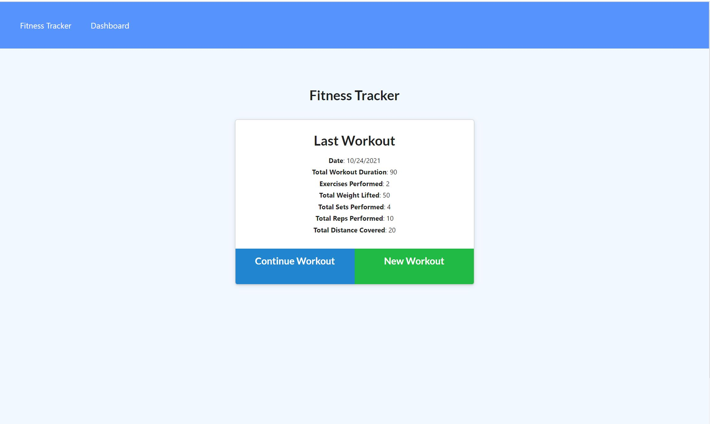

# Fitness Tracker

Fitness tracker is an application which helps the users to track their workouts in an easy way. A consumer will reach their fitness goals more quickly when they track their workout progress.

## Application

* Users will be able to view create and track daily workouts. They will be able to log multiple exercises in a workout on a given day. They will also be able to track the name, type, weight, sets, reps, and duration of exercise. If the exercise is a cardio exercise, they will be able to track the distance traveled.

When the user loads the page, they should be given the option to create a new workout or continue with their last workout.

The user will be able to:

  * Add exercises to the most recent workout plan.

  * Add new exercises to a new workout plan.

  * View the combined weight of multiple exercises from the past seven workouts on the `stats` page.

  * View the total duration of each workout from the past seven workouts on the `stats` page.

## Deployment Details

The Fitness Tracker is deployed to Heroku and uses the MongoDB Atlas. 

* The URL to the deployed application [Fitness Tracker Application](https://pure-thicket-98758.herokuapp.com/) 

* The URL to the GitHub repository [Fitness Tracker Code](https://github.com/nataliapost11/hw-fitnesstracker/) 